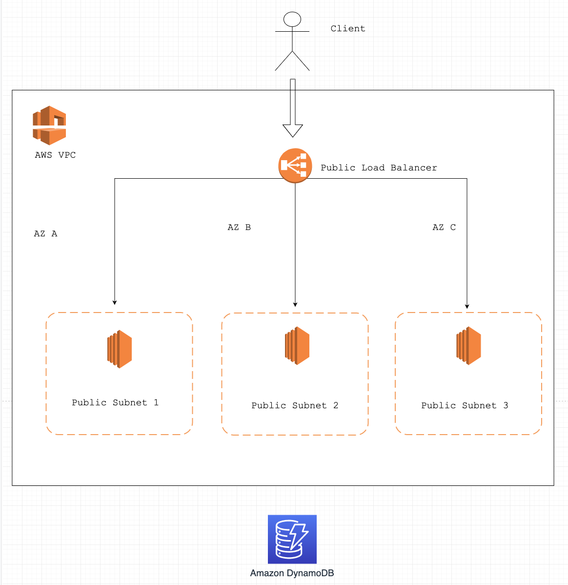

# Infrastructure automation using Terraform

## Prerequisites
1. [Terraform](https://learn.hashicorp.com/terraform/getting-started/install.html)
2. An AWS account
3. Create a IAM user with enough rights to provision the resources
4. Create an access key and a secret access key for the user
5. Update the keys in variables.tf (root directory)

## Implementation details
This repository contains Terraform infrastructure code which creates AWS resources including:

- Virtual Private Cloud (VPC) with: 3 subnets, internet gateway, security group, route table

- Compute module: 3 instances spread across 3 AZs. Each instance is using Amazon Linux OS and after they are provisioned in the cloud, using a remote-exec and a ssh connection, http will be installed. A crontab script is set up and it's inserting in a DynamoDB table the access logs from all the instances, every minute.

- The Amazon DynamoDB database

- Application Load Balancer (ALB)

## Overview
Terraform is used to create infrastructure as shown:



## Running the code

```
$ git clone https://github.com/cozmac/aws-automation.git
$ cd aws-automation
```

3. Run `terraform init` to download required providers and modules.

4. Run `terraform apply` to apply the Terraform configuration and create required infrastructure.

### Tearing down environment

**Note:** This will only destroy resources deployed by Terraform. You will need to clean up anything deployed on top of that infrastructure yourself.

```bash 
terraform destroy
```
